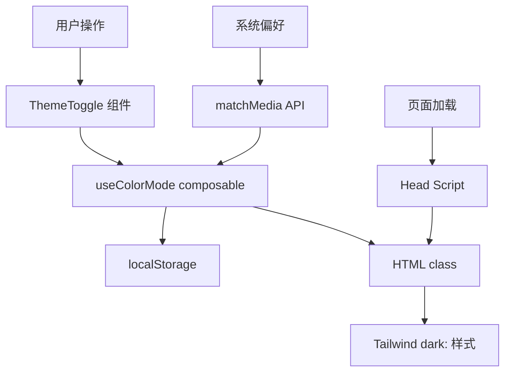

# Design Document: Dark Mode

## Overview

本设计文档描述了 TryUtils 网站完整深色模式功能的技术实现方案。该功能将使用 `@nuxtjs/color-mode` 模块实现主题切换，支持浅色、深色和跟随系统三种模式，并通过 Tailwind CSS 的 `dark:` 前缀类实现样式切换。

## Architecture

### 技术选型

1. **@nuxtjs/color-mode** - Nuxt 官方推荐的颜色模式模块
   - 自动处理 SSR 和客户端水合
   - 内置防闪烁脚本
   - 支持 localStorage 持久化
   - 支持系统偏好检测

2. **Tailwind CSS dark mode** - 使用 `class` 策略
   - 通过 `dark:` 前缀应用深色样式
   - 与 color-mode 模块完美集成

### 系统架构图



## Components and Interfaces

### 1. ThemeToggle 组件

```typescript
// components/ThemeToggle.vue
interface ThemeToggleProps {
  // 无需 props，使用全局 color-mode
}

// 组件功能：
// - 显示当前主题图标（太阳/月亮/电脑）
// - 点击循环切换主题
// - 支持键盘操作
// - 提供无障碍标签
```

### 2. useColorMode Composable

由 `@nuxtjs/color-mode` 提供：

```typescript
interface ColorMode {
  preference: 'system' | 'light' | 'dark'  // 用户偏好
  value: 'light' | 'dark'                   // 实际应用的值
}

const colorMode = useColorMode()
// colorMode.preference - 读写用户偏好
// colorMode.value - 只读，实际应用的主题
```

### 3. Nuxt 配置

```typescript
// nuxt.config.ts
export default defineNuxtConfig({
  modules: ['@nuxtjs/color-mode'],
  colorMode: {
    preference: 'system',      // 默认跟随系统
    fallback: 'light',         // 无法检测时的回退
    classSuffix: '',           // 使用 'dark' 而非 'dark-mode'
    storageKey: 'nuxt-color-mode'
  }
})
```

## Data Models

### 主题状态

```typescript
type ThemePreference = 'system' | 'light' | 'dark'
type ThemeValue = 'light' | 'dark'

interface ThemeState {
  preference: ThemePreference  // 存储在 localStorage
  value: ThemeValue            // 应用到 HTML class
}
```

### localStorage 结构

```json
{
  "nuxt-color-mode": "dark"  // 或 "light" 或 "system"
}
```

## Correctness Properties

*A property is a characteristic or behavior that should hold true across all valid executions of a system-essentially, a formal statement about what the system should do. Properties serve as the bridge between human-readable specifications and machine-verifiable correctness guarantees.*

### Property 1: Theme toggle cycles through modes
*For any* current theme preference, clicking the toggle button should cycle to the next mode in the sequence: light → dark → system → light
**Validates: Requirements 1.1**

### Property 2: Theme class matches preference
*For any* theme preference (light or dark, not system), the HTML element should have the corresponding class applied
**Validates: Requirements 1.2**

### Property 3: System mode follows OS preference
*For any* system color scheme preference, when color mode is set to "system", the applied theme should match the OS preference
**Validates: Requirements 1.3, 1.4**

### Property 4: Preference persists to localStorage
*For any* theme preference set by the user, localStorage should contain the same value
**Validates: Requirements 2.1**

### Property 5: Preference restores from localStorage
*For any* valid theme preference stored in localStorage, initializing the color mode should restore that preference
**Validates: Requirements 2.2**

### Property 6: Icon matches current mode
*For any* theme preference, the toggle button should display the corresponding icon (sun for light, moon for dark, computer for system)
**Validates: Requirements 3.2**

### Property 7: Keyboard navigation works
*For any* keyboard event (Enter or Space) on the focused toggle button, the theme should cycle to the next mode
**Validates: Requirements 3.4**

## Error Handling

### 场景处理

1. **localStorage 不可用**
   - 回退到内存存储
   - 每次页面加载使用系统偏好

2. **matchMedia 不支持**
   - 回退到浅色模式
   - 隐藏"跟随系统"选项

3. **SSR 环境**
   - 使用 cookie 传递偏好
   - Head script 在客户端立即应用

## Testing Strategy

### 单元测试

使用 Vitest 测试核心逻辑：

1. **ThemeToggle 组件测试**
   - 渲染正确的图标
   - 点击事件触发主题切换
   - 键盘事件处理

2. **主题切换逻辑测试**
   - 循环切换顺序
   - localStorage 读写

### 属性测试

使用 fast-check 进行属性测试：

1. **主题循环属性** - 验证切换顺序
2. **持久化属性** - 验证 localStorage 同步
3. **系统偏好属性** - 验证 matchMedia 响应

### 测试框架配置

```typescript
// vitest.config.ts
import { defineConfig } from 'vitest/config'

export default defineConfig({
  test: {
    environment: 'happy-dom',
    globals: true
  }
})
```

## Implementation Notes

### 需要修改的文件

1. **配置文件**
   - `nuxt.config.ts` - 添加 color-mode 模块
   - `package.json` - 添加依赖

2. **新建文件**
   - `components/ThemeToggle.vue` - 主题切换组件

3. **修改文件**
   - `app.vue` - 添加 ThemeToggle 到导航栏，更新背景样式
   - `assets/css/main.css` - 添加深色模式变量和过渡
   - 所有页面和组件 - 添加 `dark:` 样式类

### 深色模式配色方案

| 元素 | 浅色模式 | 深色模式 |
|------|----------|----------|
| 背景 | white/gray-50 | gray-900/gray-950 |
| 文字 | gray-900 | gray-100 |
| 次要文字 | gray-600 | gray-400 |
| 卡片背景 | white | gray-800 |
| 边框 | gray-200 | gray-700 |
| 主色调 | blue-600 | blue-400 |

### 过渡动画

```css
/* 主题切换过渡 */
html {
  transition: background-color 0.3s ease, color 0.3s ease;
}

html.dark {
  color-scheme: dark;
}
```
