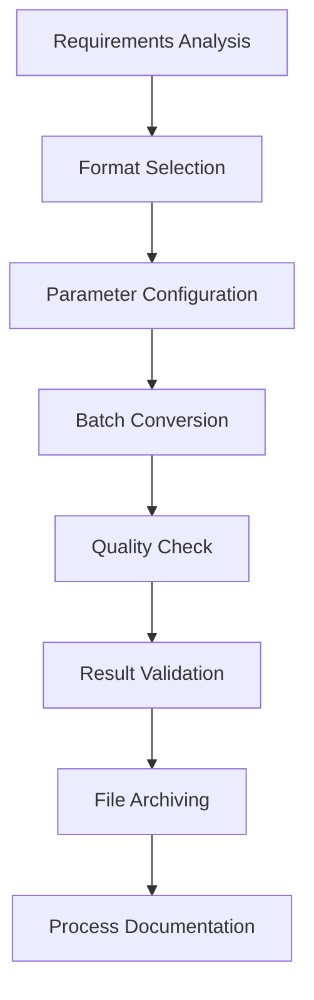

# Format Conversion Best Practices: Professional-Grade Image Processing Workflows

In today's digital work environment, image format conversion is not just a technical operation, but a professional process that requires systematic management. This article shares proven best practices to help you establish efficient and reliable image processing workflows.

## Workflow Design Principles

### 1. Standardized Processes

Establishing standardized conversion processes is fundamental to ensuring quality and efficiency:



### 2. Tiered Processing Strategy

Process images in tiers based on their purpose and importance:

| Tier | Purpose | Quality Requirements | Processing Strategy |
|------|---------|---------------------|-------------------|
| Core Assets | Brand materials, product images | Highest quality | Manual fine-tuning + multi-format backup |
| Business Content | Website images, document illustrations | High quality | Standardized batch processing |
| Temporary Materials | Test images, drafts | Standard quality | Quick conversion |

## Quality Control Standards

### Visual Quality Assessment System

```javascript
// Quality assessment standards
const QualityStandards = {
  // Compression ratio standards
  compressionRatio: {
    excellent: { min: 0.7, max: 0.9 },    // Excellent: 70-90%
    good: { min: 0.5, max: 0.7 },         // Good: 50-70%
    acceptable: { min: 0.3, max: 0.5 },   // Acceptable: 30-50%
    poor: { min: 0, max: 0.3 }            // Poor: <30%
  },
  
  // Resolution preservation standards
  resolutionPreservation: {
    critical: 1.0,      // Critical assets: 100% preservation
    important: 0.95,    // Important content: 95% preservation
    standard: 0.9,      // Standard content: 90% preservation
    basic: 0.8          // Basic content: 80% preservation
  },
  
  // Color accuracy standards
  colorAccuracy: {
    deltaE: {
      excellent: 1.0,   // ΔE < 1.0
      good: 2.0,        // ΔE < 2.0
      acceptable: 4.0,  // ΔE < 4.0
      poor: 10.0        // ΔE < 10.0
    }
  }
};
```

### Automated Quality Detection

```javascript
// Automated quality assurance system
class QualityAssurance {
  constructor(standards = QualityStandards) {
    this.standards = standards;
    this.testResults = [];
  }

  async assessImageQuality(original, converted, metadata = {}) {
    const assessment = {
      timestamp: new Date().toISOString(),
      originalFile: original.name,
      convertedFile: converted.name,
      tests: {}
    };

    // File size testing
    assessment.tests.fileSize = this.testFileSize(original, converted);
    
    // Resolution testing
    assessment.tests.resolution = this.testResolution(original, converted);
    
    // Format validation
    assessment.tests.format = this.testFormat(converted, metadata.targetFormat);
    
    // Visual quality testing (if available)
    if (this.canAnalyzeVisualQuality(original, converted)) {
      assessment.tests.visual = await this.testVisualQuality(original, converted);
    }

    // Overall scoring
    assessment.overallScore = this.calculateOverallScore(assessment.tests);
    assessment.recommendation = this.generateRecommendation(assessment);

    this.testResults.push(assessment);
    return assessment;
  }

  testFileSize(original, converted) {
    const ratio = converted.size / original.size;
    const standard = this.standards.compressionRatio;
    
    let grade = 'poor';
    if (ratio >= standard.excellent.min && ratio <= standard.excellent.max) {
      grade = 'excellent';
    } else if (ratio >= standard.good.min && ratio <= standard.good.max) {
      grade = 'good';
    } else if (ratio >= standard.acceptable.min && ratio <= standard.acceptable.max) {
      grade = 'acceptable';
    }

    return {
      passed: grade !== 'poor',
      grade: grade,
      ratio: ratio,
      originalSize: original.size,
      convertedSize: converted.size,
      savings: original.size - converted.size
    };
  }

  generateQualityReport() {
    const report = {
      summary: {
        totalTests: this.testResults.length,
        passedTests: this.testResults.filter(r => r.overallScore >= 0.7).length,
        averageScore: this.testResults.reduce((sum, r) => sum + r.overallScore, 0) / this.testResults.length
      },
      recommendations: this.generateBatchRecommendations(),
      detailedResults: this.testResults
    };

    return report;
  }
}
```

## Performance Optimization Strategies

### 1. Hardware Resource Optimization

```javascript
// System resource monitoring and optimization
class ResourceOptimizer {
  constructor() {
    this.memoryThreshold = 0.8; // 80% memory usage threshold
    this.cpuThreshold = 0.9;    // 90% CPU usage threshold
  }

  async optimizeForCurrentSystem() {
    const systemInfo = await this.getSystemInfo();
    
    return {
      recommendedConcurrency: this.calculateOptimalConcurrency(systemInfo),
      batchSize: this.calculateOptimalBatchSize(systemInfo),
      memoryManagement: this.getMemoryStrategy(systemInfo),
      processingStrategy: this.getProcessingStrategy(systemInfo)
    };
  }

  calculateOptimalConcurrency(systemInfo) {
    const cpuCores = systemInfo.cpuCores;
    const availableMemory = systemInfo.availableMemory;
    
    // Calculate optimal concurrency based on CPU cores and available memory
    const cpuBasedConcurrency = Math.max(1, cpuCores - 1);
    const memoryBasedConcurrency = Math.floor(availableMemory / (100 * 1024 * 1024)); // 100MB per concurrent operation
    
    return Math.min(cpuBasedConcurrency, memoryBasedConcurrency, 8); // Maximum of 8
  }

  getMemoryStrategy(systemInfo) {
    if (systemInfo.availableMemory < 2 * 1024 * 1024 * 1024) { // < 2GB
      return {
        strategy: 'conservative',
        batchSize: 5,
        enableGarbageCollection: true,
        processDelay: 200
      };
    } else if (systemInfo.availableMemory < 8 * 1024 * 1024 * 1024) { // < 8GB
      return {
        strategy: 'balanced',
        batchSize: 15,
        enableGarbageCollection: true,
        processDelay: 100
      };
    } else {
      return {
        strategy: 'aggressive',
        batchSize: 30,
        enableGarbageCollection: false,
        processDelay: 50
      };
    }
  }
}
```

### 2. Caching Strategy

```javascript
// Intelligent cache management
class ConversionCache {
  constructor(maxSize = 100 * 1024 * 1024) { // 100MB default cache
    this.cache = new Map();
    this.maxSize = maxSize;
    this.currentSize = 0;
  }

  generateCacheKey(file, options) {
    // Generate unique key based on file content and conversion options
    return `${file.name}_${file.size}_${file.lastModified}_${JSON.stringify(options)}`;
  }

  async get(file, options) {
    const key = this.generateCacheKey(file, options);
    const cached = this.cache.get(key);
    
    if (cached) {
      // Update access time
      cached.lastAccessed = Date.now();
      return cached.result;
    }
    
    return null;
  }

  async set(file, options, result) {
    const key = this.generateCacheKey(file, options);
    const size = this.estimateSize(result);
    
    // Check if cache cleanup is needed
    if (this.currentSize + size > this.maxSize) {
      this.cleanup(size);
    }
    
    this.cache.set(key, {
      result: result,
      size: size,
      createdAt: Date.now(),
      lastAccessed: Date.now()
    });
    
    this.currentSize += size;
  }

  cleanup(requiredSpace) {
    // LRU cleanup strategy
    const entries = Array.from(this.cache.entries())
      .sort((a, b) => a[1].lastAccessed - b[1].lastAccessed);
    
    let freedSpace = 0;
    for (const [key, value] of entries) {
      this.cache.delete(key);
      this.currentSize -= value.size;
      freedSpace += value.size;
      
      if (freedSpace >= requiredSpace) {
        break;
      }
    }
  }
}
```

## Team Collaboration Standards

### 1. File Naming Conventions

```javascript
// Standardized file naming conventions
const NamingConventions = {
  // Project prefixes
  projectPrefix: {
    website: 'web',
    mobile: 'mob',
    print: 'prt',
    social: 'soc'
  },
  
  // Content types
  contentType: {
    hero: 'hero',
    thumbnail: 'thumb',
    icon: 'icon',
    background: 'bg',
    product: 'prod',
    avatar: 'avatar'
  },
  
  // Size identifiers
  sizeIdentifier: {
    small: 's',
    medium: 'm',
    large: 'l',
    extraLarge: 'xl'
  },
  
  // Generate standard filename
  generate: function(project, contentType, identifier, size, format) {
    const timestamp = new Date().toISOString().slice(0, 10).replace(/-/g, '');
    return `${this.projectPrefix[project]}_${this.contentType[contentType]}_${identifier}_${this.sizeIdentifier[size]}_${timestamp}.${format}`;
  }
};

// Example: web_hero_homepage_l_20241226.webp
```

### 2. Version Control Strategy

```javascript
// Version management system
class VersionControl {
  constructor(baseDirectory) {
    this.baseDirectory = baseDirectory;
    this.versionHistory = new Map();
  }

  async createVersion(file, metadata = {}) {
    const fileId = this.generateFileId(file);
    const version = {
      id: this.generateVersionId(),
      timestamp: new Date().toISOString(),
      file: file,
      metadata: {
        author: metadata.author || 'unknown',
        description: metadata.description || '',
        tags: metadata.tags || [],
        quality: metadata.quality || 'standard'
      },
      parent: this.getLatestVersion(fileId)
    };

    if (!this.versionHistory.has(fileId)) {
      this.versionHistory.set(fileId, []);
    }
    
    this.versionHistory.get(fileId).push(version);
    return version;
  }

  getVersionHistory(fileId) {
    return this.versionHistory.get(fileId) || [];
  }

  rollbackToVersion(fileId, versionId) {
    const versions = this.getVersionHistory(fileId);
    const targetVersion = versions.find(v => v.id === versionId);
    
    if (targetVersion) {
      return this.createVersion(targetVersion.file, {
        ...targetVersion.metadata,
        description: `Rollback to version ${versionId}`
      });
    }
    
    throw new Error(`Version ${versionId} not found`);
  }
}
```

### 3. Collaborative Workflow

```yaml
# Team collaboration workflow configuration
workflow:
  stages:
    - name: "Requirements Analysis"
      responsible: "Project Manager"
      deliverables:
        - "Requirements document"
        - "Format specifications"
        - "Quality standards"
    
    - name: "Asset Preparation"
      responsible: "Designer"
      deliverables:
        - "Original assets"
        - "File inventory"
        - "Processing instructions"
    
    - name: "Format Conversion"
      responsible: "Technical Staff"
      deliverables:
        - "Conversion results"
        - "Quality reports"
        - "Processing logs"
    
    - name: "Quality Review"
      responsible: "Quality Control"
      deliverables:
        - "Review reports"
        - "Issue lists"
        - "Improvement suggestions"
    
    - name: "Delivery & Deployment"
      responsible: "Operations"
      deliverables:
        - "Deployment package"
        - "Usage documentation"
        - "Maintenance guide"

  approval_matrix:
    - stage: "Requirements Analysis"
      approver: "Project Manager"
    - stage: "Quality Review"
      approver: "Technical Lead"
    - stage: "Delivery & Deployment"
      approver: "Product Owner"
```

## Security and Compliance

### 1. Data Security

```javascript
// Data security management
class SecurityManager {
  constructor() {
    this.encryptionKey = this.generateEncryptionKey();
    this.auditLog = [];
  }

  async processSecureConversion(file, options) {
    // Log operation
    this.logOperation('conversion_start', {
      fileName: file.name,
      fileSize: file.size,
      timestamp: new Date().toISOString(),
      user: options.user || 'anonymous'
    });

    try {
      // Sensitivity detection
      const sensitivityCheck = await this.checkSensitivity(file);
      if (sensitivityCheck.isSensitive) {
        return this.handleSensitiveContent(file, options, sensitivityCheck);
      }

      // Normal conversion process
      const result = await this.performConversion(file, options);
      
      // Log success
      this.logOperation('conversion_success', {
        fileName: file.name,
        outputFormat: options.format,
        timestamp: new Date().toISOString()
      });

      return result;
    } catch (error) {
      // Log error
      this.logOperation('conversion_error', {
        fileName: file.name,
        error: error.message,
        timestamp: new Date().toISOString()
      });
      throw error;
    }
  }

  async checkSensitivity(file) {
    // Check if file contains sensitive information
    const checks = {
      hasPersonalInfo: await this.detectPersonalInfo(file),
      hasWatermark: await this.detectWatermark(file),
      hasCopyright: await this.detectCopyright(file)
    };

    return {
      isSensitive: Object.values(checks).some(check => check),
      details: checks
    };
  }

  generateAuditReport() {
    return {
      reportDate: new Date().toISOString(),
      totalOperations: this.auditLog.length,
      successfulOperations: this.auditLog.filter(log => log.type === 'conversion_success').length,
      failedOperations: this.auditLog.filter(log => log.type === 'conversion_error').length,
      securityIncidents: this.auditLog.filter(log => log.type === 'security_incident').length,
      detailedLog: this.auditLog
    };
  }
}
```

### 2. Compliance Checking

```javascript
// Compliance management
class ComplianceChecker {
  constructor() {
    this.regulations = {
      GDPR: {
        requiresConsent: true,
        dataRetentionLimit: 30 * 24 * 60 * 60 * 1000, // 30 days
        requiresEncryption: true
      },
      CCPA: {
        requiresNotification: true,
        allowsOptOut: true
      },
      HIPAA: {
        requiresEncryption: true,
        requiresAuditLog: true,
        accessControl: 'strict'
      }
    };
  }

  async checkCompliance(operation, jurisdiction = 'GDPR') {
    const regulation = this.regulations[jurisdiction];
    if (!regulation) {
      throw new Error(`Unknown jurisdiction: ${jurisdiction}`);
    }

    const complianceReport = {
      jurisdiction: jurisdiction,
      compliant: true,
      issues: [],
      recommendations: []
    };

    // Check compliance requirements
    if (regulation.requiresConsent && !operation.hasConsent) {
      complianceReport.compliant = false;
      complianceReport.issues.push('Missing user consent');
      complianceReport.recommendations.push('Obtain explicit user consent before processing');
    }

    if (regulation.requiresEncryption && !operation.isEncrypted) {
      complianceReport.compliant = false;
      complianceReport.issues.push('Data not encrypted');
      complianceReport.recommendations.push('Enable encryption for data processing');
    }

    return complianceReport;
  }
}
```

## Monitoring and Analytics

### 1. Performance Monitoring

```javascript
// Performance monitoring system
class PerformanceMonitor {
  constructor() {
    this.metrics = {
      conversionTimes: [],
      throughput: [],
      errorRates: [],
      resourceUsage: []
    };
  }

  startOperation(operationId) {
    return {
      id: operationId,
      startTime: performance.now(),
      startMemory: this.getCurrentMemoryUsage()
    };
  }

  endOperation(operation, result) {
    const endTime = performance.now();
    const endMemory = this.getCurrentMemoryUsage();
    
    const metrics = {
      operationId: operation.id,
      duration: endTime - operation.startTime,
      memoryUsed: endMemory - operation.startMemory,
      success: result.success,
      fileSize: result.fileSize,
      timestamp: new Date().toISOString()
    };

    this.recordMetrics(metrics);
    return metrics;
  }

  generatePerformanceReport() {
    const report = {
      summary: {
        averageConversionTime: this.calculateAverage(this.metrics.conversionTimes),
        peakThroughput: Math.max(...this.metrics.throughput),
        errorRate: this.calculateErrorRate(),
        memoryEfficiency: this.calculateMemoryEfficiency()
      },
      trends: this.analyzeTrends(),
      recommendations: this.generateOptimizationRecommendations()
    };

    return report;
  }

  generateOptimizationRecommendations() {
    const recommendations = [];
    
    const avgTime = this.calculateAverage(this.metrics.conversionTimes);
    if (avgTime > 5000) { // Over 5 seconds
      recommendations.push({
        type: 'performance',
        priority: 'high',
        message: 'Conversion time is too long, consider optimizing processing algorithms or adding hardware resources'
      });
    }

    const errorRate = this.calculateErrorRate();
    if (errorRate > 0.05) { // Error rate over 5%
      recommendations.push({
        type: 'reliability',
        priority: 'high',
        message: 'Error rate is too high, need to check input validation and error handling mechanisms'
      });
    }

    return recommendations;
  }
}
```

### 2. Business Analytics

```javascript
// Business metrics analysis
class BusinessAnalytics {
  constructor() {
    this.conversionStats = new Map();
    this.userBehavior = new Map();
    this.formatTrends = new Map();
  }

  trackConversion(conversion) {
    // Record conversion statistics
    const date = new Date().toISOString().slice(0, 10);
    if (!this.conversionStats.has(date)) {
      this.conversionStats.set(date, {
        total: 0,
        byFormat: new Map(),
        bySize: new Map(),
        byUser: new Map()
      });
    }

    const dayStats = this.conversionStats.get(date);
    dayStats.total++;
    
    // Statistics by format
    const formatKey = `${conversion.sourceFormat}_to_${conversion.targetFormat}`;
    dayStats.byFormat.set(formatKey, (dayStats.byFormat.get(formatKey) || 0) + 1);
    
    // Statistics by file size
    const sizeCategory = this.categorizeSizeCategory(conversion.fileSize);
    dayStats.bySize.set(sizeCategory, (dayStats.bySize.get(sizeCategory) || 0) + 1);
  }

  generateBusinessReport(period = 30) {
    const endDate = new Date();
    const startDate = new Date(endDate.getTime() - period * 24 * 60 * 60 * 1000);
    
    const report = {
      period: { start: startDate.toISOString(), end: endDate.toISOString() },
      summary: this.calculateSummaryMetrics(startDate, endDate),
      trends: this.analyzeTrends(startDate, endDate),
      insights: this.generateInsights(startDate, endDate),
      recommendations: this.generateBusinessRecommendations()
    };

    return report;
  }

  generateInsights(startDate, endDate) {
    return {
      mostPopularConversion: this.findMostPopularConversion(startDate, endDate),
      peakUsageTime: this.findPeakUsageTime(startDate, endDate),
      userSegments: this.analyzeUserSegments(startDate, endDate),
      formatTrends: this.analyzeFormatTrends(startDate, endDate)
    };
  }
}
```

## Continuous Improvement

### 1. Feedback Collection

```javascript
// User feedback system
class FeedbackSystem {
  constructor() {
    this.feedback = [];
    this.improvements = [];
  }

  collectFeedback(conversion, userRating, comments = '') {
    const feedback = {
      id: this.generateFeedbackId(),
      timestamp: new Date().toISOString(),
      conversion: {
        sourceFormat: conversion.sourceFormat,
        targetFormat: conversion.targetFormat,
        fileSize: conversion.fileSize,
        processingTime: conversion.processingTime
      },
      rating: userRating, // 1-5 star rating
      comments: comments,
      userAgent: navigator.userAgent,
      processed: false
    };

    this.feedback.push(feedback);
    this.analyzeFeedback(feedback);
    return feedback.id;
  }

  analyzeFeedback(feedback) {
    // Automatically analyze feedback and generate improvement suggestions
    if (feedback.rating <= 2) {
      this.generateImprovementSuggestion(feedback);
    }
  }

  generateImprovementSuggestion(feedback) {
    const suggestion = {
      id: this.generateSuggestionId(),
      timestamp: new Date().toISOString(),
      priority: feedback.rating === 1 ? 'critical' : 'high',
      category: this.categorizeFeedback(feedback),
      description: this.generateSuggestionDescription(feedback),
      relatedFeedback: feedback.id
    };

    this.improvements.push(suggestion);
  }

  generateMonthlyReport() {
    const lastMonth = new Date();
    lastMonth.setMonth(lastMonth.getMonth() - 1);
    
    const monthlyFeedback = this.feedback.filter(f => 
      new Date(f.timestamp) >= lastMonth
    );

    return {
      totalFeedback: monthlyFeedback.length,
      averageRating: this.calculateAverageRating(monthlyFeedback),
      satisfactionRate: this.calculateSatisfactionRate(monthlyFeedback),
      commonIssues: this.identifyCommonIssues(monthlyFeedback),
      improvements: this.improvements.filter(i => 
        new Date(i.timestamp) >= lastMonth
      )
    };
  }
}
```

### 2. A/B Testing Framework

```javascript
// A/B testing system
class ABTestFramework {
  constructor() {
    this.experiments = new Map();
    this.results = new Map();
  }

  createExperiment(name, variants, trafficSplit = 0.5) {
    const experiment = {
      id: this.generateExperimentId(),
      name: name,
      variants: variants, // { control: {...}, treatment: {...} }
      trafficSplit: trafficSplit,
      startDate: new Date().toISOString(),
      status: 'active',
      participants: new Map(),
      metrics: new Map()
    };

    this.experiments.set(experiment.id, experiment);
    return experiment.id;
  }

  assignVariant(experimentId, userId) {
    const experiment = this.experiments.get(experimentId);
    if (!experiment || experiment.status !== 'active') {
      return 'control'; // Default to control group
    }

    // Consistent hash assignment based on user ID
    const hash = this.hashUserId(userId);
    const variant = hash < experiment.trafficSplit ? 'treatment' : 'control';
    
    experiment.participants.set(userId, {
      variant: variant,
      assignedAt: new Date().toISOString()
    });

    return variant;
  }

  recordMetric(experimentId, userId, metricName, value) {
    const experiment = this.experiments.get(experimentId);
    if (!experiment) return;

    const participant = experiment.participants.get(userId);
    if (!participant) return;

    if (!experiment.metrics.has(metricName)) {
      experiment.metrics.set(metricName, {
        control: [],
        treatment: []
      });
    }

    experiment.metrics.get(metricName)[participant.variant].push({
      value: value,
      timestamp: new Date().toISOString(),
      userId: userId
    });
  }

  analyzeExperiment(experimentId) {
    const experiment = this.experiments.get(experimentId);
    if (!experiment) return null;

    const analysis = {
      experimentId: experimentId,
      name: experiment.name,
      participants: {
        control: Array.from(experiment.participants.values()).filter(p => p.variant === 'control').length,
        treatment: Array.from(experiment.participants.values()).filter(p => p.variant === 'treatment').length
      },
      metrics: {}
    };

    // Analyze each metric
    for (const [metricName, metricData] of experiment.metrics) {
      analysis.metrics[metricName] = this.calculateStatisticalSignificance(
        metricData.control,
        metricData.treatment
      );
    }

    return analysis;
  }
}
```

## Tool Recommendations and Integration

### Recommended Tool Stack

1. **Online Conversion Tools**
   - [TryUtils Format Converter](https://www.tryutils.com/image-format-converter): Full-featured online conversion
   - Advantages: No installation required, privacy protection, batch processing

2. **Automation Script Tools**
   - ImageMagick: Command-line batch processing
   - Sharp (Node.js): High-performance image processing
   - Pillow (Python): Python ecosystem integration

3. **Quality Monitoring Tools**
   - SSIM/PSNR calculators: Objective quality assessment
   - Color analysis tools: Color accuracy detection

### Integration Best Practices

```javascript
// Tool integration example
class IntegratedWorkflow {
  constructor() {
    this.tools = {
      converter: new TryUtilsConverter(),
      qualityChecker: new QualityAssurance(),
      performanceMonitor: new PerformanceMonitor(),
      feedbackSystem: new FeedbackSystem()
    };
  }

  async executeWorkflow(files, options) {
    const workflow = {
      id: this.generateWorkflowId(),
      startTime: Date.now(),
      results: []
    };

    try {
      // 1. Start performance monitoring
      const perfOperation = this.tools.performanceMonitor.startOperation(workflow.id);

      // 2. Batch conversion
      const conversionResults = await this.tools.converter.convertBatch(files, options);

      // 3. Quality checking
      for (const result of conversionResults) {
        const qualityAssessment = await this.tools.qualityChecker.assessImageQuality(
          result.original,
          result.converted,
          options
        );
        result.quality = qualityAssessment;
      }

      // 4. End performance monitoring
      const perfMetrics = this.tools.performanceMonitor.endOperation(perfOperation, {
        success: true,
        fileCount: files.length
      });

      workflow.results = conversionResults;
      workflow.performance = perfMetrics;
      workflow.endTime = Date.now();

      return workflow;
    } catch (error) {
      workflow.error = error.message;
      workflow.endTime = Date.now();
      throw error;
    }
  }
}
```

## Summary

Establishing professional format conversion best practices requires:

1. **Standardized Processes**: Ensure consistency and repeatability
2. **Quality Control**: Build multi-layered quality assurance systems
3. **Performance Optimization**: Efficiently utilize resources and improve processing efficiency
4. **Team Collaboration**: Establish clear collaboration standards and processes
5. **Security and Compliance**: Ensure data security and regulatory compliance
6. **Continuous Improvement**: Continuously optimize through monitoring and feedback

By implementing these best practices, you can establish an efficient, reliable, and scalable image format conversion system that meets various business needs.

---

*Ready to implement professional format conversion workflows? Start with the [TryUtils Format Converter](https://www.tryutils.com/image-format-converter) to experience standardized conversion processes.*